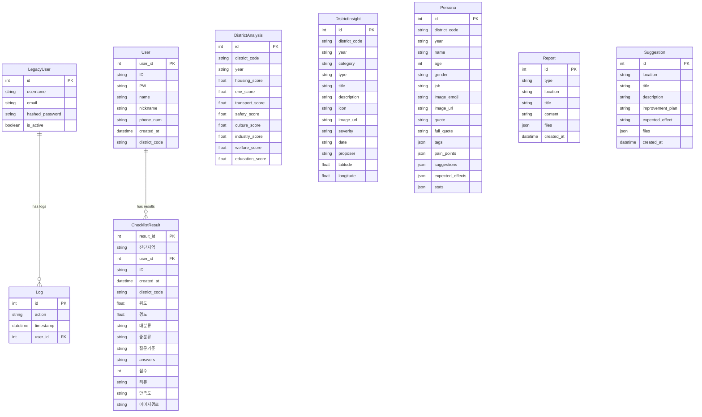

# Database ERD (sql_app_v2.db)

Based on `backend/models.py`.

```mermaid
erDiagram
    LegacyUser {
        int id PK
        string username
        string email
        string hashed_password
        boolean is_active
    }

    Log {
        int id PK
        string action
        datetime timestamp
        int user_id FK
    }

    User {
        int user_id PK
        string ID
        string PW
        string name
        string nickname
        string phone_num
        datetime created_at
        string district_code
    }

    ChecklistResult {
        int result_id PK
        string 진단지역
        int user_id FK
        string ID
        datetime created_at
        string district_code
        float 위도
        float 경도
        string 대분류
        string 중분류
        string 질문기준
        string answers
        int 점수
        string 리뷰
        string 만족도
        string 이미지경로
    }

    DistrictAnalysis {
        int id PK
        string district_code
        string year
        float housing_score
        float env_score
        float transport_score
        float safety_score
        float culture_score
        float industry_score
        float welfare_score
        float education_score
    }

    DistrictInsight {
        int id PK
        string district_code
        string year
        string category
        string type
        string title
        string description
        string icon
        string image_url
        string severity
        string date
        string proposer
        float latitude
        float longitude
    }

    Persona {
        int id PK
        string district_code
        string year
        string name
        int age
        string gender
        string job
        string image_emoji
        string image_url
        string quote
        string full_quote
        json tags
        json pain_points
        json suggestions
        json expected_effects
        json stats
    }

    Report {
        int id PK
        string type
        string location
        string title
        string content
        json files
        datetime created_at
    }

    Suggestion {
        int id PK
        string location
        string title
        string description
        string improvement_plan
        string expected_effect
        json files
        datetime created_at
    }

    LegacyUser ||--o{ Log : "has logs"
    User ||--o{ ChecklistResult : "has results"
```
